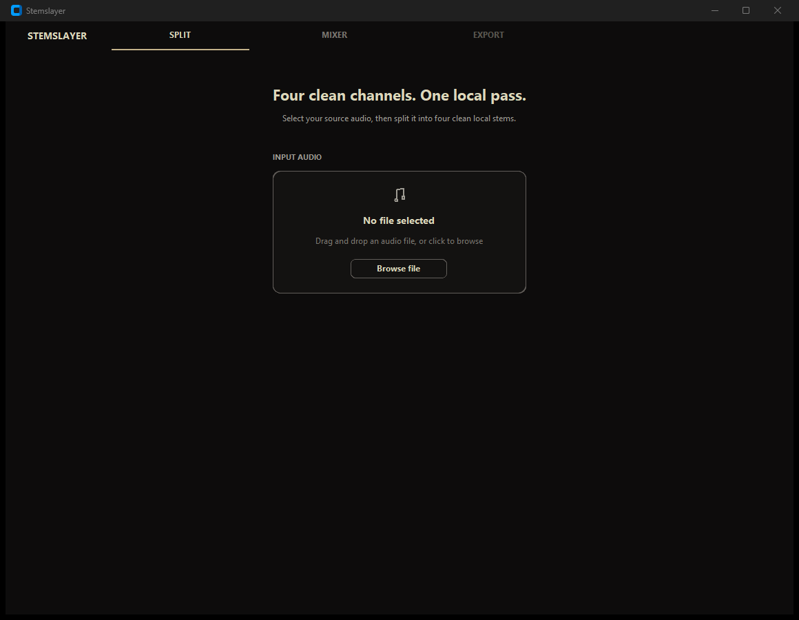
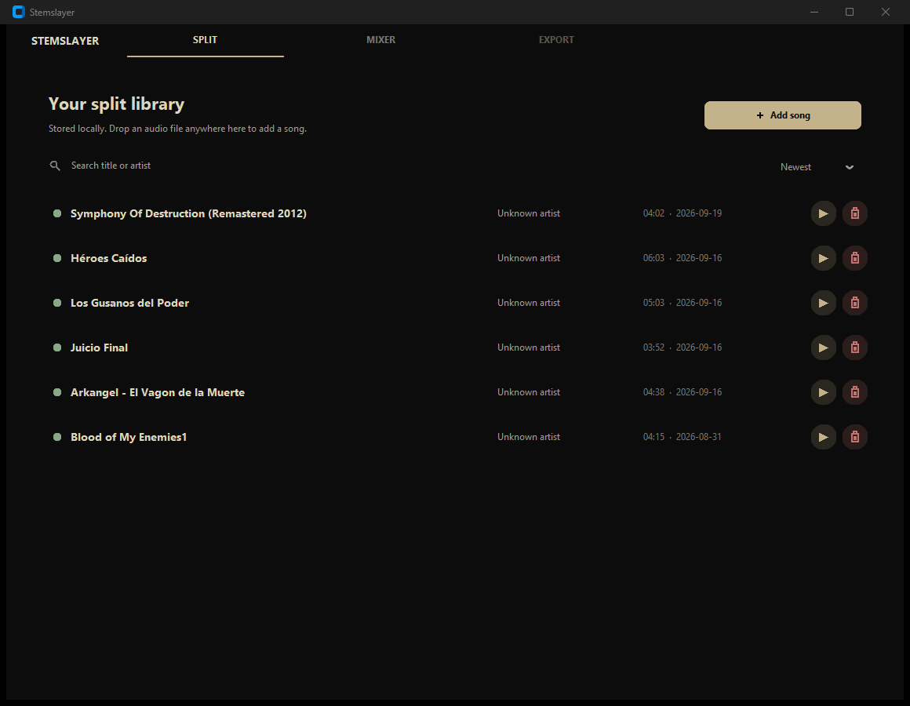
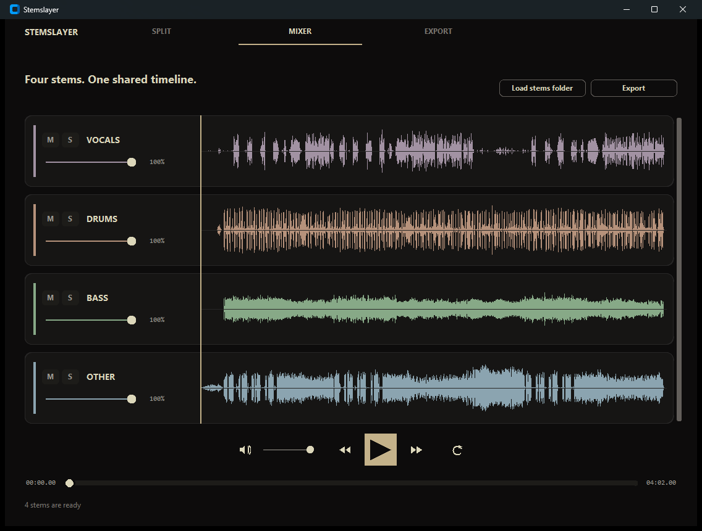
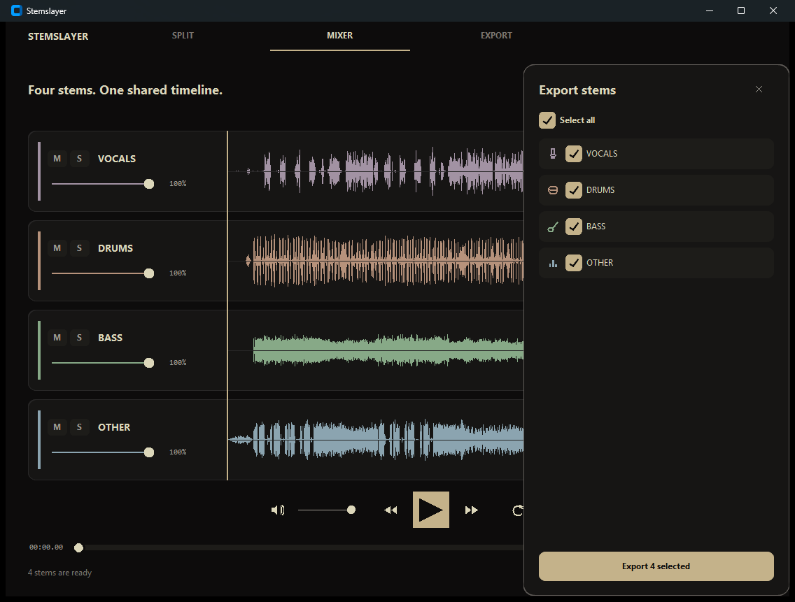
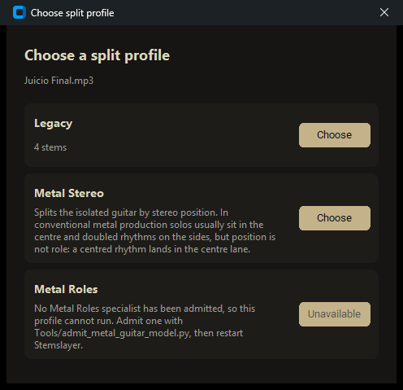

# Manual de usuario de Stemslayer

## Qué es Stemslayer

Stemslayer es una aplicación de escritorio para Windows que separa una canción en pistas independientes (voz, batería, bajo y el resto de instrumentos) usando Demucs. Introduces una canción y obtienes esas pistas por separado, listas para escuchar y exportar. Todo el proceso ocurre en tu propio equipo: no se sube nada a internet.

## Qué versión debo descargar

**Regla rápida:** ¿tu ordenador tiene una tarjeta gráfica NVIDIA (GeForce, RTX o GTX) con el driver actualizado?

- **Sí** → descarga la versión **CUDA**.
- **No, o no lo sabes** → descarga la versión **CPU**.

| Versión | Para qué máquina | Tamaño de descarga | Velocidad | Requisitos |
| --- | --- | --- | --- | --- |
| **CUDA** — `Stemslayer-vX.Y.Z-windows-x64-cuda-portable.zip` | Equipos con GPU NVIDIA compatible y driver actualizado | ~2 GB | Sustancialmente más rápida | Necesita hardware NVIDIA compatible |
| **CPU** — `Stemslayer-vX.Y.Z-windows-x64-cpu-portable.zip` | Cualquier PC con Windows | ~210 MB | Varios minutos por canción | Ninguno especial |

¿Por qué la versión CUDA pesa diez veces más? Porque el ZIP lleva dentro el runtime de NVIDIA necesario para ejecutar la separación en la GPU. La versión CPU no necesita ese runtime, por eso es tan ligera.

**Si tienes dudas, elige la versión CPU.** Funciona en cualquier equipo con Windows: es la opción de compatibilidad.

### Cómo sé si tengo una tarjeta NVIDIA

1. Abre el menú Inicio de Windows.
2. Escribe "Administrador de dispositivos" y ábrelo.
3. Despliega "Adaptadores de pantalla".
4. Si ves un nombre que contiene NVIDIA, GeForce, RTX o GTX, tienes una tarjeta compatible y puedes usar la versión CUDA.

## Cómo instalarlo

1. Ve a [GitHub Releases](https://github.com/jfmedellin/separador-pistas/releases) y descarga el ZIP que corresponda a tu máquina según la tabla anterior.

   **Importante:** no uses el botón **Code → Download ZIP** de la página del repositorio. Eso descarga el código fuente del proyecto, no la aplicación, y necesitarías tener Python instalado para poder usarlo.

2. Extrae el ZIP descargado en una carpeta donde tengas permiso de escritura.
3. Ejecuta `Stemslayer.exe` desde esa carpeta.

No hace falta instalador, ni Python, ni Git, ni instalar Demucs por separado: todo lo necesario ya está dentro del ZIP. Si quieres comprobar que la descarga no se corrompió, cada ZIP tiene un archivo `.sha256` opcional en la misma página de Releases para verificar su integridad.

## La primera vez que lo abres

Al abrir Stemslayer por primera vez verás la pestaña SPLIT vacía, con el mensaje "No file selected" y un botón **Browse file** para elegir tu canción. En cuanto elijas el archivo, la aplicación te preguntará con qué perfil separarlo (ver [Los perfiles](#los-perfiles-legacy-y-metal-stereo)).

La primera vez que separes una canción con el perfil por defecto (Legacy), la aplicación descarga los pesos del modelo `htdemucs`. Esta descarga solo ocurre una vez y necesita conexión a internet; después de esa primera vez, todo funciona sin conexión. Si eliges el perfil Metal Stereo por primera vez, se descarga un segundo modelo, `htdemucs_6s`, porque es un modelo distinto al de Legacy.

## Las ventanas de la aplicación

Stemslayer tiene tres pestañas: SPLIT, MIXER y EXPORT.

### SPLIT

En la pestaña SPLIT puedes arrastrar un archivo de audio hasta la zona de "INPUT AUDIO", o pulsar **Browse file** para elegir el archivo desde el explorador de Windows.

Cuando ya tienes canciones separadas, esta pestaña muestra tu "biblioteca de splits" ("Your split library"). Cada fila representa una canción separada e incluye:

- Un punto verde: indica que esa separación está lista para escucharse.
- El título, el artista, la duración y la fecha de la separación.
- Un botón de reproducción, que abre esa canción en el MIXER.
- Un botón de papelera, que elimina esa separación.

También puedes usar el campo "Search title or artist" para buscar por título o artista, y el desplegable "Newest" para cambiar el orden de la lista. El botón **+ Add song** añade una canción nueva sin salir de la biblioteca. Esta biblioteca se guarda de forma local en tu propio equipo, no en ningún servidor.

### MIXER

En el MIXER escuchas las pistas separadas de una canción, todas sincronizadas en una única línea de tiempo. Cada fila (o "lane") corresponde a una pista: VOCALS, DRUMS, BASS y OTHER (o las seis del perfil Metal Stereo).

| Control | Qué hace |
| --- | --- |
| Play / Pause | Inicia o pausa todas las pistas publicadas a la vez, sobre una única línea de tiempo compartida. |
| Saltar atrás / adelante | Avanza o retrocede 10 segundos sobre la posición actual, sin salirse de los límites de la canción. |
| Loop | Al llegar al final, reinicia la canción en lugar de detenerse. |
| Línea de tiempo (Timeline) | Haz clic o arrastra para moverte a cualquier punto. Un único indicador (playhead) cruza todas las pistas a la vez. |
| Volumen general (Master volume) | Atenúa la mezcla final. Actúa después de mezclar todas las pistas y antes de la salida, así que nunca puede provocar que el volumen supere el máximo. |
| Volumen por pista (Volume) | Atenúa una pista concreta, de 100% a 0%. No existe una opción para amplificarla por encima del 100%. |
| **M** | Silencia esa pista (mute). El silencio siempre gana sobre el solo: si silencias una pista que también está en solo, no se escuchará. |
| **S** | Deja sonando solo esa pista (solo). Puedes activar el solo en varias pistas a la vez. |

También puedes usar **Load stems folder** para abrir una carpeta que ya contenga los archivos WAV de una separación anterior, sin tener que volver a separar la canción.

Un ejemplo práctico: si quieres aprender una parte de guitarra, activa **S** solo en esa pista para escucharla aislada, o actívala como **M** para silenciarla y tocar tú esa parte mientras suena el resto de la canción.

### EXPORT

Desde el MIXER, el botón **Export** abre un panel donde eliges qué pistas quieres guardar. Puedes marcar "Select all" para elegir todas, o marcar solo las que necesites. Al pulsar el botón de exportar (por ejemplo, "Export 4 selected"), Stemslayer copia esas pistas, en formato WAV, a la carpeta que elijas.

## Los perfiles: Legacy y Metal Stereo

Cada vez que eliges una canción, Stemslayer te pregunta con qué perfil quieres separarla:

- **Legacy** (el perfil por defecto) publica cuatro pistas: vocals, drums, bass y other.
- **Metal Stereo** publica seis: las mismas cuatro, más Guitar Center y Guitar Sides.
- **Metal Roles** aparece en la lista pero con el botón **Unavailable**: no se puede elegir, y el propio diálogo explica por qué.

### Lo que Metal Stereo hace de verdad, sin adornos

**Stemslayer no separa la guitarra líder de la guitarra rítmica. Ningún perfil de esta aplicación lo hace, y ninguno lo pretende.**

Metal Stereo divide la guitarra ya aislada según **dónde se ubica en la imagen estéreo**, no según lo que está tocando. Es útil por cómo se suele mezclar el metal: las guitarras rítmicas se graban dobladas y paneadas a los lados, mientras los solos suelen ir centrados. Por eso, silenciar `Guitar Sides` normalmente deja el solo audible. Pero eso es una correlación con la forma en que se mezcló esa música, **no una garantía y no un reconocimiento musical real**.

Por eso falla en formas predecibles:

- Una parte rítmica grabada centrada termina en la pista central, junto con el solo.
- Un solo amplio y armonizado hacia los lados termina en la pista de los lados.
- Cualquier otro elemento centrado que sobreviva dentro de la pista de guitarra queda junto al solo, en la pista central.

Esta es exactamente la razón por la que las pistas se llaman por su posición ("Center", "Sides") y nunca por un rol musical ("lead", "rhythm").

El tercer perfil, **Metal Roles** (guitarra líder / guitarra rítmica), aparece en el diálogo marcado como **Unavailable**, a propósito, mostrando el motivo en lugar de ocultarlo: no se ha admitido ningún modelo especialista capaz de hacer esa separación, así que el perfil no puede ejecutarse. No se activa cambiando una opción ni editando un ajuste. Puedes leer la razón técnica completa, y qué tendría que cumplir un modelo para ser admitido, en [ARCHITECTURE.md](ARCHITECTURE.md).

## Preguntas frecuentes

**¿Sube mi música a internet?**
No. Todo el proceso de separación ocurre en tu propio equipo. La conexión a internet solo se usa la primera vez, para descargar el modelo.

**¿Por qué tarda tanto en CPU?**
Varios minutos por canción es normal en la versión CPU; es el precio de la compatibilidad universal. En equipos con al menos ocho procesadores lógicos, la versión CPU usa dos workers de fragmento coordinados y un solapamiento del 10% para reducir el tiempo de proceso; ese solapamiento más bajo es un equilibrio razonable y puede reducir ligeramente la calidad en los límites de cada fragmento, comparado con el 25% que usa Demucs por defecto.

**¿Puedo usarlo en Mac?**
No. Esta versión es exclusiva para Windows; macOS queda explícitamente fuera de alcance.

**¿Necesito instalar Python?**
No, no hace falta para el ZIP portable.

**¿Qué pasa si vuelvo a separar la misma canción?**
Las siguientes ejecuciones reutilizan la caché local del modelo, y si el resultado completo ya existe para ese mismo archivo, se reutiliza en lugar de recalcularlo.

**¿Puedo separar guitarra líder de guitarra rítmica?**
No. Consulta la sección "Los perfiles: Legacy y Metal Stereo" más arriba para entender por qué.

## Qué NO hace esta versión

Esta versión excluye, de forma intencionada:

- Soporte para macOS.
- Panning (control de posición estéreo).
- Exportar una mezcla combinada en un solo WAV.
- Zoom sobre la forma de onda.
- Selección del dispositivo de salida de audio.
- Guardar los ajustes del mezclador entre sesiones.
- Separación de guitarra líder y guitarra rítmica.

Esto es alcance definido a propósito, no una disculpa.

---

Si eres desarrollador y quieres compilar el proyecto desde el código fuente o entender su arquitectura interna, consulta [DEVELOPMENT.md](DEVELOPMENT.md) y [ARCHITECTURE.md](ARCHITECTURE.md).
