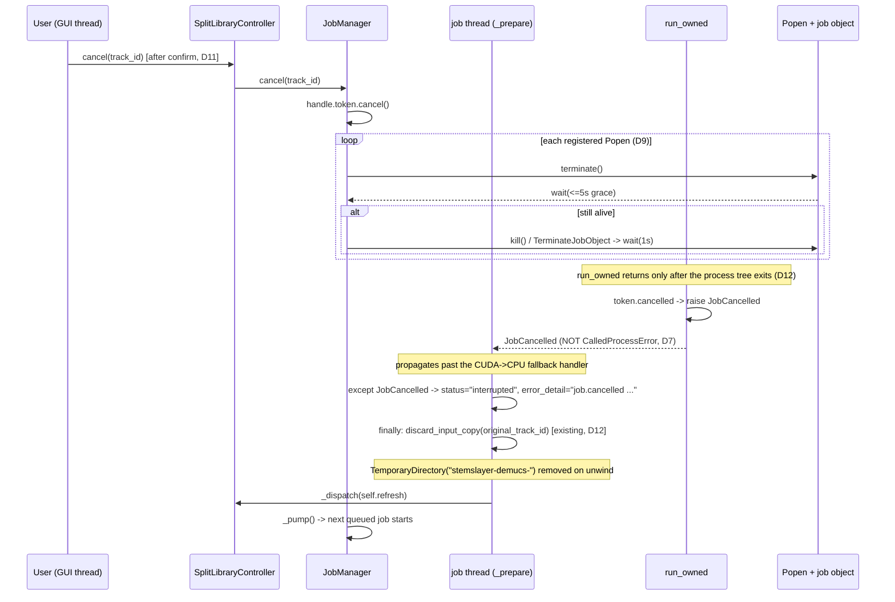

# Design: Review Phase 2 — Job Lifecycle (ARC-03 + ARC-04)

## Technical Approach

Three slices, one PR each, in the proposal's order **ARC-04 → ARC-03 core → ARC-03 surface**.

One new module, `SeparationWorker/job_manager.py`, owns three things that are currently
unowned: **admission** (FIFO deque + concurrency 1), **the child process** (a registered
`Popen` per job, plus its Win32 job object), and **the cancellation token** (one
`CancellationToken` per job, finally reaching `publish_atomic`).

The design's central move is that **no signature on the hot path changes**. Both adapters
already build an options dict and hand an argv list to `subprocess.run`; they swap that one
call for `run_owned(...)`, which is `subprocess.run` plus registration, token checks, and
terminate→grace→kill escalation. `separate_audio`'s existing-but-dead `cancellation=` kwarg
is finally passed a real token by `_prepare`. Nothing about `_command()`, `frozen_worker_path()`,
`CREATE_NO_WINDOW`, the argv list, or the options dict moves.

## Architecture Decisions

| # | Decision | Alternatives rejected | Rationale |
|---|---|---|---|
| D1 | New `SeparationWorker/job_manager.py`, sibling to `history.py`/`demucs_adapter.py`; holds `JobManager`, `JobHandle`, `JobCancelled`, and the module-level `run_owned()` primitive | put it in `engine/`; put the queue in `history.py`; a third `process_ownership.py` module | Same layering rule as Phase 1's D1: `engine/` holds profile/manifest/publication primitives, not adapters. `history.py` is already store + controller in one file and admission must be testable with no SQLite. A third module for ~50 lines with exactly two consumers is not worth the import surface. No cycle: `history → job_manager → engine.publication` |
| D2 | Queue is a `collections.deque` + one `threading.Lock` + a non-reentrant `_pump()` loop | `queue.Queue`; `ThreadPoolExecutor(max_workers=1)` | Cancel and close-drain must **remove arbitrary pending entries** and **read queue order** for the derived label; `queue.Queue` offers neither. `ThreadPoolExecutor.shutdown(wait=True)` is unbounded (breaks D10's deadline), `Future.cancel()` cannot stop a running job, and it owns thread creation that the existing tests inject via `start_worker=` |
| D3 | `JobManager` keeps `start_worker` injectable and `SplitLibraryController` keeps its `start_worker=` kwarg, forwarding it into the manager it builds | make `SplitLibraryController` take only a `JobManager` | The 411-test baseline injects `start_worker=lambda fn: fn()` to run jobs synchronously. Forwarding preserves every existing test verbatim. `_pump()` is loop-based, not recursive, so a synchronous worker drains the queue iteratively instead of nesting one stack frame per queued job |
| D4 | Queue-position updates travel the existing `_dispatch` path: `JobManager(on_queue_change=...)` → `SplitLibraryController._queue_changed` → `self._dispatch(...)` → `replace(state, queued_track_ids=ids)` → `_on_change`. No DB query on a queue event | GUI polls `manager.queued_ids()` on a `root.after` timer | Exactly the pattern `_relay_model_progress` (`history.py:539-548`) established for `on_model_progress`: the callback fires on a worker thread, so it must be marshalled, never touched directly. Polling adds a second state source and a visible lag against an otherwise event-driven render. `LibraryState` gains one defaulted field — it is a frozen dataclass updated by `replace()`, so this is additive |
| D5 | `run_owned` finds its `JobHandle` through a `threading.local` bound by `JobManager` around the job body; the `runner(command)` protocol is untouched | change `runner` to `runner(command, *, cancellation)`; thread the handle through `separate_audio`→`_command` | `runner` is an injected seam with 25 `separate_audio` callers and a fake in nearly every adapter test; changing it converts a lifecycle fix into a repo-wide signature migration. The adapter also cannot name its own runner, so it cannot hand it a handle. The subprocess always runs on the job's own thread, which is exactly where the binding lives. Ambient state is the acknowledged cost; it is contained to one function, and `run_owned` with no current job behaves exactly as today (CLI, `Tools/`, tests) |
| D6 | Token flows **explicitly** (`_prepare` → `separate_audio(cancellation=handle.token)` → `publish_atomic`); only the *process registry* is ambient (D5). Both reference the same `CancellationToken` instance | make `run_owned` read the token from an added kwarg; drop the explicit `cancellation` param and read everything ambiently | The explicit channel already exists and the spec requires it observable at `commit_if_active`; using it costs one argument. Ambient state is spent only where no parameter exists |
| D7 | A cancelled owned process raises **`JobCancelled`**, not `subprocess.CalledProcessError` | let the kill surface as `CalledProcessError`; reuse `PublicationError("publication.cancelled")` | **Correctness, not taste.** `separate_audio:512-521` catches `CalledProcessError` on the CUDA attempt and *reruns the whole inference on CPU*. A killed child returns non-zero, so a `CalledProcessError` would relaunch a multi-minute job the user just cancelled. `JobCancelled` propagates past that handler untouched. `PublicationError` is a publication-semantics type (`retryable`, `reconciliation_action`) that `separate_audio` maps into user-facing failure text |
| D8 | `run_owned` checks the token at **entry and at exit**, so every launch site — the CUDA attempt, the CPU fallback, and `run_specialist` — is guarded with zero new checks inside `separate_audio` | add `_cancelled(cancellation)` calls throughout `separate_audio` | Every job-owned subprocess in the codebase funnels through one function; guarding the funnel is complete by construction and cannot be forgotten by a future launch site |
| D9 | Cancel escalation is `terminate()` → 5 s grace → `kill()`, applied to a **Win32 job object** created per owned process with `JOB_OBJECT_LIMIT_KILL_ON_JOB_CLOSE`, via stdlib `ctypes`; any Win32 failure degrades silently to plain `Popen.terminate()`/`kill()` | `taskkill /T /F /PID`; `CREATE_NEW_PROCESS_GROUP` + `CTRL_BREAK_EVENT`; accept orphaned grandchildren | `Popen.terminate()` is `TerminateProcess` and kills **only** the direct child. Demucs with `--jobs N>0` (`_cpu_jobs()`, `demucs_adapter.py:146-149`) spawns a process pool, and under PyInstaller those children re-launch the same exe — so single-process terminate would leave this change's headline guarantee provably false. A job object is the only option that also reaps the tree if the **GUI itself** dies (handle closes → OS terminates). `CTRL_BREAK_EVENT` needs a console the `CREATE_NO_WINDOW` GUI does not have. `taskkill` forks a process during shutdown and gives nothing on GUI crash. Phase 1's D9 rejected `ctypes` because `msvcrt` offered the same guarantee; here **no stdlib API provides tree-kill**, so `ctypes` is the minimum, not a preference — and the fallback degrades to strictly-better-than-today, never worse |
| D10 | `shutdown(deadline)` spends **one** monotonic budget (default 8 s = 5 s grace + 1 s kill + join slack) shared across all jobs; every wait uses `max(0.0, deadline - monotonic())`; returns `bool` and never raises | per-job deadline; unbounded `thread.join()`; `os._exit()` | A per-job deadline lets N queued jobs multiply the freeze. Worker threads are already `daemon=True`, so a thread that outlives the budget cannot keep the process alive past `main()`. `os._exit()` would skip the mixer/`stem_cache` cleanup `_close` already performs |
| D11 | Closing with work in flight asks **one** confirmation before `self._closed = True`; the per-row Cancel button asks its own confirmation. Both say the work is lost and not resumable | close silently cancels; no confirmation anywhere | Resolved decision #2 requires the UI to state that cancel means kill before confirming, and a multi-minute job is exactly the work an accidental window close destroys. `_closed` must be set only *after* confirmation, or a declined close leaves the app in a half-closed state |
| D12 | Cancel cleanup is **reuse only** — no new filesystem code. The single added line maps `JobCancelled` / `publication.cancelled` to `status="interrupted"` before the generic `except Exception` → `failed` | add explicit partial-result removal on the cancel path | Traced, not assumed: mid-subprocess output lives in `tempfile.TemporaryDirectory(prefix="stemslayer-demucs-")` (`demucs_adapter.py:506`), removed on exception unwind; `publish_atomic`'s staging dir has its own `finally: shutil.rmtree` (`publication.py:245-247`) and `final` is created only by the commit; the staged input copy is removed by `_prepare`'s existing `finally: discard_input_copy` (`history.py:669-674`), which fires on `JobCancelled` like any other exception. A queued job cancelled before start has nothing on disk at all, because the input copy is staged at job start (resolved decision #1). `purge_input_copies()` at next startup remains the backstop for a hard GUI kill |
| D13 | `guitar_adapter.run_specialist` gets the identical one-line `run_owned` swap, even though `run_specialist`/`separate_guitar_roles` have **zero production callers today** (verified repo-wide: only `guitar_adapter.py` and `test_guitar_adapter.py`) | defer it until a specialist profile ships | Resolved decision #3's guarantee must be true the moment a specialist profile is bound, and the cost here is one call site sharing an already-written primitive. The design records the non-caller fact rather than implying the path is live |

## Data Flow

### Cancel while running



### Close while jobs are queued

```mermaid
sequenceDiagram
    participant U as User
    participant A as StemslayerApp._close
    participant M as JobManager.shutdown
    participant Q as pending deque
    participant T as running job thread

    U->>A: WM_DELETE_WINDOW
    A->>M: queued_ids() / running?
    alt work in flight
        A->>U: confirm "stop running work?" (D11)
        U-->>A: declined -> return, _closed stays False
    end
    A->>A: _closed = True; show "Stopping jobs..."; update_idletasks()
    A->>M: shutdown(deadline=8.0)   [one budget, D10]
    M->>M: draining = True
    M->>Q: drain pending -> status="interrupted" each, never started
    M->>T: token.cancel() + terminate/grace/kill on every registered process
    M->>T: thread.join(timeout=max(0, deadline - monotonic()))
    M-->>A: True (all joined) | False (budget spent; threads are daemons)
    A->>A: mixer_controller.close(); stem_cache.discard(...)   [existing]
    A->>A: root.destroy()
```

## File Changes

| File | Action | Description |
|---|---|---|
| `SeparationWorker/job_manager.py` | Create | `JobHandle`, `JobManager`, `JobCancelled`, `run_owned()`, the `threading.local` job context (D5), and the `ctypes` Win32 job-object helper with its fallback (D9) |
| `SeparationWorker/demucs_adapter.py` | Modify | `run_demucs` (113-135): the options dict, `_cpu_process_environment`, and `CREATE_NO_WINDOW` are unchanged; `subprocess.run(list(command), **options)` becomes `run_owned(list(command), **options)`. `separate_audio` (438-575) unchanged — it already forwards `cancellation` to `publish_atomic` |
| `SeparationWorker/guitar_adapter.py` | Modify | `run_specialist` (162-177): the same single-call swap (D13) |
| `SeparationWorker/history.py` | Modify | `SplitLibraryController.__init__` builds a `JobManager(start_worker=..., on_queue_change=...)` (D3, D4); `add` (581-588) and `retry` (590-603) call `submit` instead of `_start_worker`; `_prepare` (605-675) takes `handle`, passes `cancellation=handle.token`, and gains an `except JobCancelled` / cancelled-`PublicationError` branch → `interrupted` (D12); new `cancel(track_id)`, `shutdown(deadline)`, `_queue_changed`; `LibraryState` gains `queued_track_ids: tuple[str, ...] = ()` |
| `SeparationWorker/gui.py` | Modify | Per-row Cancel action + confirm; `_render_library` renders "Queued" over `preparing` rows in `state.queued_track_ids`; `_close` (1901-1914) confirms, then drains before `root.destroy()` (D10, D11) |
| `SeparationWorker/runtime/__init__.py`, `runtime/supervisor.py`, `runtime/worker_main.py` | Delete | ARC-04, slice 1 |
| `Tests/Portable/test_worker_runtime.py` | Delete | Exercises only removed code |
| `Tests/Portable/test_job_manager.py` | Create | Queue order, concurrency bound, escalation, bounded shutdown |
| `Tests/Portable/test_history.py` | Modify | Queue/cancel/`interrupted` regressions |
| `Tests/Portable/test_demucs_adapter.py` | Modify | `run_owned` raises `CalledProcessError` identically; cancel does **not** trigger the CPU fallback (D7) |

## Interfaces / Contracts

```python
# job_manager.py
class JobCancelled(RuntimeError):
    """Raised by run_owned when the owning job's token is set. Deliberately NOT a
    subprocess.CalledProcessError, so it bypasses separate_audio's CUDA->CPU fallback (D7)."""

@dataclass
class JobHandle:
    job_id: str                       # == track_id
    token: CancellationToken          # engine.publication.CancellationToken
    def register(self, process) -> None: ...
    def unregister(self, process) -> None: ...

def current_job() -> JobHandle | None: ...        # threading.local, bound by JobManager (D5)

def run_owned(command: Sequence[str], **options):
    """subprocess.run's contract, plus ownership. Raises JobCancelled if the current
    job's token is set at entry or at exit; otherwise raises the identical
    subprocess.CalledProcessError(returncode, cmd, output=...) that check=True produced,
    so _diagnostic_tail/_failure_cause keep working unchanged. Returns only after the
    owned process tree has exited (D12)."""

class JobManager:
    def __init__(self, *, max_concurrency: int = 1,
                 start_worker: Callable[[Callable[[], None]], None] = _start_thread,
                 on_queue_change: Callable[[tuple[str, ...]], None] = lambda _ids: None,
                 grace_seconds: float = 5.0, kill_seconds: float = 1.0) -> None: ...
    def submit(self, job_id: str, run: Callable[[JobHandle], None]) -> None: ...
    def cancel(self, job_id: str) -> str | None:   # "queued" | "running" | None
    def queued_ids(self) -> tuple[str, ...]: ...
    def shutdown(self, *, deadline: float = 8.0) -> bool: ...   # bounded; never raises
```

Cancelled rows land on the existing terminal status with a distinct detail, matching the
`f"{cause} {recovery}"` shape at `history.py:666`:

```python
status="interrupted",
error_detail="job.cancelled Separation was cancelled; no partial result was kept. "
             "Retry from the original audio.",
```

## Testing Strategy

| Layer | What to test | Approach |
|---|---|---|
| Unit | Fifth `submit` at concurrency 1 queues instead of rejecting; jobs start in FIFO order; `on_queue_change` reports exact order | `JobManager` with a controllable `start_worker` and blocking job bodies |
| Unit | `terminate()` then exit inside grace → `kill()` never called; no exit → `kill()` called once | Fake process object (the `ScriptedProcess` shape the deleted test used) injected into the escalation helper |
| Unit | `shutdown()` returns within the deadline when a job body refuses to finish; returns `False` rather than blocking | Job body waits on a never-set `Event`; assert wall time < deadline + slack |
| Unit | `run_owned` with no current job behaves exactly like `subprocess.run` (CLI/Tools path unaffected) | Real short-lived `sys.executable -c` process |
| Integration | Cancel during the CUDA attempt does **not** run the CPU fallback | Injected `runner` that sets the token and raises `JobCancelled`; assert the runner is called once |
| Integration | `CalledProcessError.output` still reaches `_diagnostic_tail` after the `Popen` swap | Child that writes to stdout then exits non-zero |
| Integration | Cancel mid-run → `interrupted` with the cancellation detail, no `inputs/{track_id}`, no `library_root/{track_id}`; `retry()` still succeeds | Full controller lifecycle in `test_history.py` |
| Integration | `commit_if_active` blocks the commit when the token is set just before publication | Token set from a `validate=` hook passed into `publish_atomic` |
| Integration | `_close`-shaped drain cancels one running + three queued jobs; queued jobs never start a subprocess | `SplitLibraryController.shutdown()` against a fake separate |

All new tests must fail on current `master` and pass after the change.

## Threat Matrix

| Boundary | Applicability | Design response | Planned RED tests |
|---|---|---|---|
| Subprocess argument composition | **Applicable** — both adapters change their launch call | Argv list preserved verbatim, `shell=False`, no new argument; `_command()`, `frozen_worker_path()`, `_cpu_process_environment`, and `CREATE_NO_WINDOW` are byte-identical inputs to `run_owned` | Captured argv and options identical before/after the swap |
| Process termination authority | **Applicable** — new kill capability | Terminate **only** handles this process created and registered; never by PID lookup, never by image name (`taskkill /IM StemslayerWorker.exe` would kill an unrelated process) | `cancel()` on an unknown job id is a no-op; escalation touches only registered handles |
| Process integration / child-tree containment | **Applicable** — grandchildren from `--jobs N` | Win32 job object with `KILL_ON_JOB_CLOSE`; fallback to direct terminate on any Win32 failure; known bounded gap: a grandchild spawned between `Popen()` returning and assignment is unowned | Fallback path forced → direct child still terminates; apply-time tree check (C.2) |
| Native/ctypes surface | **Applicable** — new `ctypes` kernel32 calls | Confined to one helper, `sys.platform == "win32"` guarded, explicit `restype`/`argtypes`, every failure returns `False` and degrades; no `Global\` namespace, no privileged object | Simulated Win32 failure never raises into the job body |
| Cancellation vs. atomic commit | **Applicable** — a cancel racing publication | `CancellationToken.commit_if_active` (`publication.py:122-126`) already serializes the decision with the rename; this change only makes it reachable | Cancel set before `commit_if_active` leaves no `library_root/{track_id}` |
| Documentation-like paths | N/A — no file classification changes | | |
| Git repository selection / Commit state / Push state / PR commands | N/A — no VCS or PR automation | | |

## Apply-Time Verification

Mirrors Phase 1's C.1/C.2 pattern: these cannot be proven from source at design time.

- **C.1 — zero non-test importers of `SeparationWorker.runtime` (slice 1, before deletion).**
  Two checks, because grep alone cannot see a dynamic import:
  1. `rg -n "SeparationWorker\.runtime|from \.runtime|import runtime" --glob '!Tests/**' --glob '!openspec/**' .` → expect zero hits.
  2. Import-block proof:
     `python -c "import sys; sys.modules['SeparationWorker.runtime']=None; import SeparationWorker.gui, SeparationWorker.cli, SeparationWorker.history, SeparationWorker.demucs_adapter, SeparationWorker.guitar_adapter, SeparationWorker.demucs_worker; print('ok')"`
     (`sys.modules[name] = None` makes any import of that name raise `ImportError`.)
  3. Resolve the proposal's ambiguous CodeGraph `run` edge specifically:
     `rg -n "Supervisor|supervisor" SeparationWorker/demucs_adapter.py SeparationWorker/guitar_adapter.py` → expect zero, which falsifies "real caller" and confirms the edge is `subprocess.run`.
  Design-time pre-check already returned clean on all three and found no `hiddenimports`
  entry in `Tools/stemslayer_portable.spec`; the apply step must re-run them, not cite this.
- **C.2 — frozen-build process behavior (slice 2, on a real portable build).**
  1. `StemslayerApp` self-test still resolves the worker: `--self-test` (`gui.py:1929-1932`) exits 0.
  2. No console window flashes during a split → `CREATE_NO_WINDOW` survived the `Popen` swap.
  3. Force a Demucs failure → the error detail still shows a diagnostic tail → `communicate()`
     preserved the `stdout=PIPE, stderr=STDOUT` capture `subprocess.run` gave.
  4. Cancel a CPU run started with `--jobs > 0`: Task Manager shows `StemslayerWorker.exe`
     **and every child it spawned** gone within the grace period (D9's actual claim).
  5. Force the job-object fallback (fault-inject the helper): cancel still terminates the
     direct child, and close still completes within the deadline.

## Migration / Rollout

No schema change; `SCHEMA_VERSION` stays `2` and `tracks.status` keeps its existing
`CHECK` set — cancelled rows reuse `interrupted` (resolved decision #2). The queue is
memory-only, so a crash needs no reconciliation: `recover_unfinished()` already retires
`preparing`/`processing` rows to `interrupted` at startup. No new runtime dependency
(`ctypes`, `collections`, `threading` are stdlib). Ship order and rollback are the
proposal's; slice 1 reverts by restoring three deleted files, slice 2 by restoring
`subprocess.run`, slice 3 by removing the cancel UI and the `_close` drain.

## Open Questions

- [ ] Widget placement for the Cancel action and the derived "Queued" label — the controller
      contract (`cancel(track_id)`, `LibraryState.queued_track_ids`) is settled; the binding
      is an apply-time detail, exactly as Phase 1 left `on_progress`'s widget open.
- [ ] Whether `max_concurrency` is surfaced as a user setting or stays a constructor default.
      The design supports both; the proposal only commits to a default of 1.
