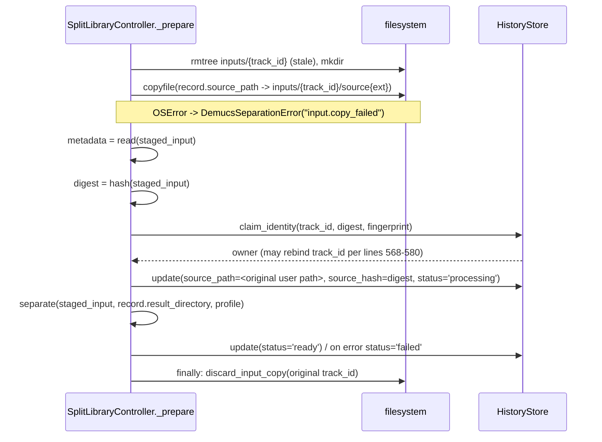

# Design: Review Phase 1 — Correctness & Security Foundation

## Technical Approach

Three independent fixes, one PR each, in the order **ARC-01 → ARC-02 → SEC-01**.

- **SEC-01** — a new app-owned `model_manager` acquires and SHA-256-verifies weights into a
  per-model `LocalRepo`-shaped directory; `_command()` always passes `--repo <dir>`, which
  structurally prevents `RemoteRepo`/`torch.hub` from ever running.
- **ARC-01** — an OS-held exclusive lock in `main()` before any `HistoryStore` construction.
- **ARC-02** — an immutable job-owned input copy made **before** hashing; hash, metadata read,
  and inference all read that copy.

The model manager deliberately mirrors an admission pattern this repo already ships:
`guitar_adapter.resolve_specialist` (`guitar_adapter.py:83-140`) — a frozen in-code registry
with full SHA-256, re-hashed on every call, fail-closed with `code`/`cause`/`recovery`.

## Architecture Decisions

| # | Decision | Alternatives rejected | Rationale |
|---|---|---|---|
| D1 | New `SeparationWorker/model_manager.py` + `model_manifest.py`, sibling to `demucs_adapter.py`/`guitar_adapter.py` | put it in `engine/` | `engine/` holds profile/manifest/publication primitives; acquisition is an adapter-layer concern |
| D2 | Manifest is a frozen Python constant (`REGISTERED_MODELS: Mapping[str, ModelEntry]`), not a JSON data file | shipped JSON; remote manifest | PyInstaller collects modules automatically (no `.spec` `datas` entry, no `_MEIPASS` resolution); a data file on disk is editable by the same attacker verification must stop |
| D3 | `model_manager` defines its own `ModelAcquisitionError(code, cause, recovery)`; `separate_audio` catches it and re-raises `DemucsSeparationError` | import `DemucsSeparationError` into `model_manager` | `demucs_adapter` imports `model_manager`, so the reverse import is a cycle. `guitar_adapter` sets the precedent with its own `GuitarSpecialistError`. All 12 existing `DemucsSeparationError` callers keep seeing one type |
| D4 | `local_data_root()` moves to new `SeparationWorker/paths.py`; `history.py` re-exports it | `model_manager` imports from `history` | `history → demucs_adapter → model_manager → history` is a cycle. Re-export keeps every existing import working |
| D5 | **Per-model** repo dir `local_data_root()/models/{model_name}/` | one shared repo dir | `LocalRepo` scans the whole directory; a half-populated shared dir could break an unrelated model. Per-model is complete-or-absent, and matches "download on first use per profile" |
| D6 | Re-verify every file's SHA-256 on **every** invocation, not only after download | verify once at download | Fail-closed (resolved decision #1); defends the cache against later tampering; identical to `resolve_specialist`. ~0.2 s per 80 MB vs. minutes of inference |
| D7 | Bag `.yaml` files are copied from the vendored `demucs/remote/` and SHA-256-verified; only `.th` weights are downloaded | re-author YAML in the manifest; download the YAML | Reuses already-trusted local bytes without duplicating upstream bag definitions, and still verifies them |
| D8 | Streaming staging-dir + `os.replace` placement, **not** `publish_atomic` | reuse `publish_atomic` | It takes `dict[str, bytes]` (an 80 MB read into RAM) and its exists-path raises non-retryable `publication.reconciliation_required` — wrong semantics for a cache. Same *pattern*, different code |
| D9 | ARC-01 uses `msvcrt.locking(fd, LK_NBLCK, 1)` on `local_data_root()/instance.lock`, `fcntl.flock` fallback | Win32 named mutex via `ctypes.windll.kernel32.CreateMutexW`; presence-only sentinel file; SQLite v3 lease | `msvcrt` is a stdlib builtin PyInstaller bundles with no hidden-import config and no ctypes ABI surface (`restype`/`argtypes`, `Global\` privilege). The OS drops the lock on process death. A sentinel file leaks after hard kill (named risk). A lease means a schema change and a heartbeat thread (out of scope) |
| D10 | **Input copy lives at `local_data_root()/inputs/{track_id}/source{ext}`, OUTSIDE `library_root`** | `library_root/{track_id}/input{ext}` (exploration's suggestion) | **Refinement of the exploration.** `publish_atomic(library_root, track_id, files)` short-circuits to `reconcile_publication` when `library_root/{track_id}` exists (`publication.py:188-189`) and raises non-retryable `publication.reconciliation_required` for any unexpected file (`publication.py:99-105`). A copy inside `result_directory` would break every publication, and also confuse `_is_reusable_existing_result` (`demucs_adapter.py:488`) and `_discard_invalid_managed_result` (`history.py:610-626`) |
| D11 | The copy path is derived from `track_id`, never stored in SQLite; `tracks.source_path` keeps the user's original path | new `staged_input_path` column | No schema change (proposal's assumption holds), and `retry()` still has the original path to re-copy from |

## Data Flow

### SEC-01 — model acquisition

```mermaid
sequenceDiagram
    participant P as _prepare (history.py:594)
    participant S as separate_audio
    participant M as model_manager.ensure_model
    participant N as urllib (HTTPS only)
    participant D as demucs.separate subprocess

    P->>S: separate(staged_input, result_dir, profile)
    Note over S: input validated; reusable-result short-circuit taken first
    S->>M: ensure_model(profile.primary_model, on_progress)
    M->>M: entry = REGISTERED_MODELS[name] (KeyError -> model.unregistered)
    alt repo dir exists
        M->>M: re-verify SHA-256 of every file (D6)
    else absent or mismatch
        M->>M: rmtree stale dir; mkdtemp staging
        M->>N: stream each .th to <staging>/<file>.part
        N-->>M: bytes + on_progress(file, done, total)
        M->>M: SHA-256 == manifest? no -> model.hash_mismatch (FAIL CLOSED)
        M->>M: copy+verify bag .yaml from demucs/remote (D7)
        M->>M: os.replace(staging, models/{name})
    end
    M-->>S: repo_dir
    S->>D: _command(..., "--repo", repo_dir, ...)
    Note over D: LocalRepo only — RemoteRepo/torch.hub unreachable
```

Failure at any `M` step raises `ModelAcquisitionError`; `separate_audio` re-raises
`DemucsSeparationError("model.hash_mismatch" | "model.download_failed" |
"model.unregistered", ...)`. There is no fallback download path.

### ARC-02 — prepare with immutable input



Retry safety: `retry()` (`history.py:544-557`) re-enters `_prepare`, which re-copies from the
unchanged `tracks.source_path`. Deleting the copy at *any* terminal state (ready **and**
failed) is therefore safe.

## File Changes

| File | Action | Description |
|------|--------|-------------|
| `SeparationWorker/paths.py` | Create | `local_data_root()` (D4) |
| `SeparationWorker/model_manifest.py` | Create | `ModelFile`/`ModelEntry` frozen dataclasses + `REGISTERED_MODELS` |
| `SeparationWorker/model_manager.py` | Create | `ensure_model()`, verify, download, atomic place, `ModelAcquisitionError` |
| `SeparationWorker/instance_lock.py` | Create | `acquire_single_instance(root) -> bool`, process-lifetime handle |
| `SeparationWorker/demucs_adapter.py` | Modify | `_command()` (218-248) takes `repo` and emits `--repo`; `separate_audio()` calls `ensure_model` between lines 489 and 492 and passes `repo` to both `_command` calls (497, 507) |
| `SeparationWorker/gui.py` | Modify | `main()` (1900-1913) acquires the lock before `ctk.CTk()`; optional `on_progress` wiring |
| `SeparationWorker/history.py` | Modify | `local_data_root` re-export; `_prepare()` (559-608) copy-first + `finally` cleanup; `HistoryStore.discard_input_copy()` / `purge_input_copies()`; `remove()` (445-461) also drops the copy |
| `Tools/stemslayer_portable.spec` | Modify | Stale comment (line 3) about Demucs' own download |
| `Tests/Portable/test_model_manager.py` | Create | SEC-01 regression tests |
| `Tests/Portable/test_instance_lock.py` | Create | ARC-01 regression tests |
| `Tests/Portable/test_history.py` | Modify | ARC-02 mutate-between-hash-and-separate regression test |

## Interfaces / Contracts

```python
# model_manifest.py
@dataclass(frozen=True)
class ModelFile:
    file_name: str          # "955717e8-8726e21a.th" | "htdemucs.yaml"
    sha256: str             # full 64-hex, app-owned
    source: str             # "download" | "bundled"
    urls: tuple[str, ...] = ()   # https:// only; empty for "bundled"

@dataclass(frozen=True)
class ModelEntry:
    model_name: str         # matches StemProfile.primary_model
    files: tuple[ModelFile, ...]

REGISTERED_MODELS: Mapping[str, ModelEntry]

# model_manager.py
def ensure_model(
    model_name: str,
    *,
    cache_root: Path | None = None,          # defaults to local_data_root()/"models"
    registry: Mapping[str, ModelEntry] | None = None,
    opener: Callable[[str], IO[bytes]] | None = None,   # injected for tests
    on_progress: Callable[[str, int, int], None] | None = None,
) -> Path: ...                               # returns the verified repo directory

# instance_lock.py
def acquire_single_instance(root: Path | None = None) -> bool: ...
```

`ensure_model` is fully injectable (`cache_root`, `registry`, `opener`) so tests never touch
the network or `%LOCALAPPDATA%`, matching how `separate_audio` injects `runner`/`cuda_probe`.

Second-instance UX (resolved decision #3), in `main()` before `ctk.CTk()`:
a throwaway `tkinter.Tk()` + `withdraw()` + `messagebox.showerror(...)` + `destroy()`,
wrapped in `try/except` (also writing to `stderr`), then `return 1`. No CustomTkinter theme,
no `TkinterDnD.require`, no `StemslayerApp`, no `HistoryStore` — so no history row is touched.

## Testing Strategy

| Layer | What to test | Approach |
|-------|--------------|----------|
| Unit | Hash mismatch fails closed; unregistered model fails; non-`https` URL rejected; no partial dir survives a mid-download failure | `ensure_model` with fake `opener`/`registry` into `tmp_path` |
| Unit | Verified cache is reused without calling `opener` | assert opener call count == 0 on second call |
| Unit | Second `acquire_single_instance()` in a spawned subprocess returns `False`; first still holds | `subprocess.run([sys.executable, "-c", ...])` against a temp root |
| Unit | Lock released after the holder process exits | spawn, exit, re-acquire in-process |
| Integration | `_command()` output always contains `--repo <dir>` (both CPU and CUDA-fallback calls) | capture argv via injected `runner` |
| Integration | Mutating the source file after `add()` cannot bind mismatched stems | fake `separate` asserts its input digest == `tracks.source_hash` |
| Integration | Input copy is deleted on `ready` and on `failed`; `retry()` re-copies and succeeds | inspect `inputs/{track_id}` across the lifecycle |
| Integration | `publish_atomic` still succeeds with the copy in place (D10 regression) | full lifecycle test in `test_stem_lifecycle_integration.py` |

All new tests must fail on current `master` and pass after the change.

## Threat Matrix

| Boundary | Applicability | Design response | Planned RED tests |
|---|---|---|---|
| Documentation-like / executable-file classification | **Applicable** — `.th` weights are pickle payloads `torch.load` executes | Full SHA-256 admission before any path reaches the subprocess; `--repo` blocks unverified bytes entirely; fail closed with no override | Hash mismatch, unregistered name, tampered cache file |
| Subprocess argument composition | **Applicable** — `_command()` gains `--repo` | Argv list, no `shell=True`; `repo` is an app-derived `Path`, never user input; both CPU and CUDA-fallback invocations carry it | `--repo` present in both `_command` calls |
| Network fetch | **Applicable** — new outbound HTTPS in `model_manager` | Manifest URLs only, `https://` scheme enforced, timeout + size cap, streamed to `.part`, verified before placement | Non-`https` URL rejected; truncated stream leaves no repo dir |
| Process integration / instance exclusivity | **Applicable** — new cross-process lock | OS-held exclusive lock acquired before any DB open; second instance exits without touching SQLite | Second instance cannot alter `preparing`/`processing` rows |
| Git repository selection | N/A — no VCS automation |  |  |
| Commit state | N/A — no VCS automation |  |  |
| Push state | N/A — no VCS automation |  |  |
| PR commands | N/A — no VCS automation |  |  |

## Migration / Rollout

No schema change; `SCHEMA_VERSION` stays `2`. The proposal's assumption holds for all three
fixes. Ship order **ARC-01 → ARC-02 → SEC-01**: ARC-02 adds a startup
`purge_input_copies()` next to `recover_unfinished()` (`gui.py:514-515`), which is only safe
once exactly one instance can reach that code. Rollback is per-PR as the proposal states;
orphaned `inputs/` or `models/` directories are inert to an older build.

## Open Questions

- [ ] **Blocking for SEC-01 only**: the trusted SHA-256 digests and the exact file set for
      `htdemucs` and `htdemucs_6s` (bag `.yaml` + member `.th`) must be produced out-of-band.
      This design specifies the *mechanism*; it cannot supply the values.
- [ ] Verify at apply time that the frozen worker (`runtime/worker_main.py` →
      `frozen_worker_path()`) forwards `--repo` verbatim to `demucs.separate`, and that
      PyInstaller collects `demucs/remote/*.yaml` (D7 depends on it).
- [ ] Exact GUI widget bound to the download-progress callback — the controller hook
      (`on_progress`, matching the existing `on_change`/`on_success` convention) is settled;
      the widget binding is an apply-time detail.
